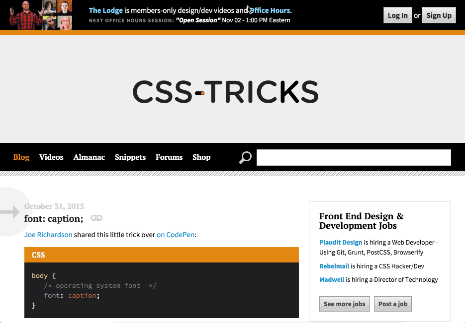

# FRONT-END APPLICATIONS

## INDEX

*  1 Changing Expectations : structured code is vitally important

* Refactoring

* Creating Promises

* Chaining Promises

* Ajax with XHR

* Ajax with Jquery

* Ajax with Fetc

* Features of Single Page Apps

* Examine Framework's Source

* Angular

* Ember

* The beneficts of Offline First

* Introducing the Service Worker

* Project: Restaurant Reviews App Stage 1


# Lesson 1 Changing Expectations

## 1.1 Project Cat Clicker

**Remind:**

If you're writing Cat Clicker with vanilla JS (no jQuery), you'll be adding the "click" event with elem.addEventListener().

```javascript
var elem = document.getElementById('my-elem');
elem.addEventListener('click', function(){
  //the element has been clicked... do stuff here
}, false);

```

If you're using jQuery, you'll be adding the "click" event listener with jQuery.click().


```javascript
$('#my-elem').click(function(e) {
  //the element has been clicked... do stuff here
});

```

## 1.2 Closures and Event Listeners

```javascript
var nums = [1,2,3];

for (var i = 0; i < nums.length; i++) {

    // This variable keeps changing every time we iterate!
    //  It's first value is 1, then 2, then finally 3.
    var num = nums[i];

    // On click...
    elem.addEventListener('click', function() {

        // ... alert num's value at the moment of the click!
        alert(num);

        // Specifically, we're alerting the num variable 
        // that's defined outside of this inner function.
        // Each of these inner functions are pointing to the
        // same `num` variable... the one that changes on
        // each iteration, and which equals 3 at the end of 
        // the for loop.  Whenever the anonymous function is
        // called on the click event, the function will
        //  reference the same `num` (which now equals 3).

    });

};

```

The solution involves utilizing closures. We're going to create an inner scope to hold the value of num at the **exact moment we add the event listener**. 

```javascript

var num = nums[i];

elem.addEventListener('click', function() {

    alert(num);

});


elem.addEventListener('click', (function(numCopy) {
    return function() {
        alert(numCopy)
    };
})(num));


```
* IIFE (Immediately-Invoked Function Expression, pronounced like "iffy"): method of wrapping an anonymous function in parentheses and calling it right away.

## 1.3 The Final Version

```javascript

// clear the screen for testing
document.body.innerHTML = '';

var nums = [1,2,3];

// Let's loop over the numbers in our array
for (var i = 0; i < nums.length; i++) {

    // This is the number we're on...
    var num = nums[i];

    // We're creating a DOM element for the number
    var elem = document.createElement('div');
    elem.textContent = num;

    // ... and when we click, alert the value of `num`
    elem.addEventListener('click', (function(numCopy) {
        return function() {
            alert(numCopy);
        };
    })(num));

    document.body.appendChild(elem);
};

```

Quality of a good projet

* stable bug-free
* cleanly written
* scale well
* extensible

## 1.4 [Introduction to MVO - Model Octopus View](https://classroom.udacity.com/nanodegrees/nd001/parts/e4e4c31c-2348-4382-826f-caac197d6f5f/modules/4db0b091-fc81-40c2-b7f0-a4ded06480e1/lessons/3417188540/concepts/33740985660923)

* Model is where all of the data is stored (data form the server and the user)

* Octopus connect the Model and the View (functionality)

* View (DOM elements, inputs, buttons and images) user's interface of your application, both for reading your application data and for reading data - It something that the user sees and interacts with (no data or functionality)

acronyms like 
* **MVC** Model View Controller
* **MVVM** Model View View Model
* **MVP** Model View Presenter
* **MV*** Model View Whatever

[quiz](https://youtu.be/juPqC4hnmeQ)

[quiz](https://youtu.be/lZWV5qvA4vM)


## 1.5 What Is the Model in Our Code

[video 1](https://youtu.be/Y_OG0y45slI)

[video 2](https://youtu.be/DgUi2YCUVF0)

[video 3](https://youtu.be/vhSBVX_CEEE)


* Link to the [Pizza Repository](https://github.com/udacity/ud989-pizzamvo)

[video 4](https://youtu.be/EGZci21y9dw)

Repository for [Udacity Retain](https://github.com/udacity/ud989-retain)

Take a few minutes to explore the organization of Udacity Retain.

* How is it organized?
    * Does the model ever talk to the view directly?
    * How about the view to the model?
* Add comments to the code if you'd like.

[video 5](https://youtu.be/aAP2GQb1mlA)

[video 6](https://youtu.be/RhnqbWxtG8U)

* **localStorage.clear()**

[quiz](https://youtu.be/eYyLBvE3sFA)

[quiz - Identify Model and View](https://youtu.be/by16pN39cc8)

[video 7 - Review Model and View for CC Premium](https://youtu.be/W1280ms4mdA)

[video 9 - Identify Octopus](https://youtu.be/KbWalBpacaY)

[video 10 - Andy’s Code 1](https://youtu.be/Yjj1MTIineA)

[quiz Andy’s Code 1](https://youtu.be/HIidMQJ3J3s)

[quiz Andy’s Code 2](https://youtu.be/laXNA7xyumI)

[quiz](https://youtu.be/UO0y7CAx_wo)

## 1.6 Refactor Spaghetti Code

* [Interview with Nic](https://youtu.be/LOAnZInn1jI)

Refactoring is the process which you take a piace of code and make it more readable and more maintanable without changing its functionality.

So that means you might want to break up large functions or complicated function without changing the way they're acced by the outside world or the other components of your application.


* [Interview with Jacques](https://youtu.be/PU0CwUqrDkY)

* [Request next Exercise](https://youtu.be/W4RoPqW2Zsg)
    * [School Attendance Application](https://github.com/udacity/ud989-school-attendance)


Lesson 3 Creating Promises

Sounds used courtesy of Freesound Project, creative commons license: [Tristan Lohengrin](https://freesound.org/people/Tristan_Lohengrin/)

## Lesson 3.1

[Callbacks vs Promises](https://youtu.be/9nwPenviboM)

[Callbacks vs Thens](https://youtu.be/RR0MoEoHb9U)

Callbacks are the default Javascript technique for asynchronous work. Pass the function to another function, 
and the call the callback function at some later time when some conditions have beeb met.

* How do you handle arrors?
    * it's best pratice to assume that any operation could fail at any time. eg. Network requests.
* if an error occurs here should you still execute the call back?


```javascript

var sequence = get('example.json')
.then(doSomething)
.then(doSomethingElse)

```
[Course Map](https://youtu.be/CEwQLIsmGCM)

* Wrapping 
* Thening
* Catching
* Chaining

4 Fase

* **Fulfilled (Resolved)**: (```It worked```) means that action related to the promises succeded. This state is also known as *resolved*.

* Rejected: (```It didn't work```) means that action related to the promises failed. 

* Pending: (```Still waiting```)  means that has not yet fulfilled or rejected. 

Setteld: (```Something happened```) which means that the promises has either fulfilled or rejected. 

[JavaScript Promises - Jake Archibald](http://www.html5rocks.com/en/tutorials/es6/promises/)

```javascript
var promise = new Promise(function(resolve, reject) {
  // do a thing, possibly async, then…

  if (/* everything turned out fine */) {
    resolve("Stuff worked!");
  }
  else {
    reject(Error("It broke"));
  }
});

promise.then(function(result) {
  console.log(result); // "Stuff worked!"
}, function(err) {
  console.log(err); // Error: "It broke"
});

```

[Promise Timeline](https://youtu.be/SCuo55DgIwk)

[quiz Async Scenarios](https://youtu.be/xSvYvK7MwYE)


* [Syntax](https://youtu.be/ikoar93RWe4)

```javascript

new Promise(function(resolve) {
  console.log('first');
  resolve();
  console.log('second');
}).then(function() {
  console.log('third');
});

```

The values themselves they're being passed to the functions called by ```.then``` or ```.catch```.

* [Write Your First Promise](https://youtu.be/8CxHueAZM3s)

* [Write Your First Promise Solution](https://youtu.be/VK9Nyvmx5lY)

* [Wrapping readyState](https://youtu.be/85UkGKKZUxs)


To Read 

* [**6 Reasons Why JavaScript’s Async/Await Blows Promises Away (Tutorial)**](https://hackernoon.com/6-reasons-why-javascripts-async-await-blows-promises-away-tutorial-c7ec10518dd9)

* [hrottling the Network in Chrome DevTools](https://css-tricks.com/throttling-the-network/)

* Open DevTools
* Click the ‘Network’ tab
* Select which type of connection you want to imitate
* Reload the page to see assets downloading at that connection speed

* 

* [Document.readyState](https://developer.mozilla.org/en-US/docs/Web/API/Document/readyState)

* [network throttling](https://developers.google.com/web/tools/chrome-devtools/network-performance/network-conditions)
* [Simulate network throttling for up-to-date information](https://developers.google.com/web/tools/chrome-devtools/network-performance/reference#throttling)

## 3.2 IMPORTANT! Working w/Exoplanet Explorer

**What is this?**

You'll be working with a stripped down version of the [Exoplanet Explorer](http://www.exoplanetexplorer.com/) to complete all of the programming quizzes for the rest of the course. So, you need to install it.

**Installation**

I built the Exoplanet Explorer from the [Polymer](https://www.polymer-project.org/1.0/) [Starter Kit](https://developers.google.com/web/tools/polymer-starter-kit/?hl=en). I'm copying most of the rest of these instructions from the README written by the Polymer team. If you ever need help, check out the README.

**Clone the repo first (for everyone)**

Here's the link to the repo.

You should be on the ```hr-start branch```. If not, then ```git checkout xhr-start``` or ```git checkout origin xhr-start```.

**Quick-start (for experienced users)**

With Node.js installed, run the following one liner from the root of your Exoplanet Explorer download:

```npm install -g gulp bower && npm install && bower install```

**Prerequisites (for everyone)**

The full starter kit requires the following major dependencies:

* Node.js, used to run JavaScript tools from the command line.
* npm, the node package manager, installed with Node.js and used to install Node.js packages.
* gulp, a Node.js-based build tool.
* bower, a Node.js-based package manager used to install front-end packages (like Polymer).

**To install dependencies:**

1) Check your Node.js version.

```
node --version
```
The version should be at or above 0.12.x.


2) If you don't have Node.js installed, or you have a lower version, go to [nodejs.org](https://nodejs.org/) and click on the big green Install button.

3) Install ```gulp``` and ```bower``` globally.

```
npm install -g gulp bower
```

This lets you run ```gulp``` and ```bower``` from the command line.

4) Install the starter kit's local ```npm``` and ```bower``` dependencies.

```
cd exoplanet-explorer && npm install && bower install
```
This installs the element sets (Paper, Iron, Platinum) and tools the starter kit requires to build and serve apps.

**NOTE! INSTALLATION MAY TAKE A LONG TIME!**
 There are many dependencies to download and install.

**Post-Installation and Workflow**

For every quiz, you'll be given a branch to checkout. You can always find it in the instructor notes. All of your work will be done in:

```
app/scripts/app.js
```
**Serve / watch**

```
gulp serve
```

This outputs an IP address you can use to locally test and another that can be used on devices connected to your network.

It's recommended to use Chrome, as non-vulcanized Polymer projects will load fastest on Chrome.

**Build & Vulcanize**

```
gulp
```

Build and optimize the current project, ready for deployment. This includes linting as well as vulcanization, image, script, stylesheet and HTML optimization and minification.

**Troubleshooting**

See [this bug](https://github.com/nodejs/node-gyp/issues/695) if you get the following error from Gyp:

```
"Error: self signed certificate in certificate chain"
```
## [Wrap an XHR - Solution](https://youtu.be/cWqEP9ZBDvk)


**Instructions** 

1. If you haven't already, read this and follow the instructions on working with the Exoplanet Explorer repo.

2. Checkout the ```xhr-start``` branch and navigate to ```app/scripts/app.js```.

3. Wrap the XHR in a Promise in the get() function. See [XHR documentation](https://developer.mozilla.org/en-US/docs/Web/API/XMLHttpRequest/Using_XMLHttpRequest) for more information.

4. Resolve on load and reject on error.

5. If the XHR resolves, use ```addSearchHeader()``` to add the search header to the page.

6. If the XHR fails, ```console.log()``` the error and pass ```'unknown'``` to ```addSearchHeader()```.

Checkout ```xhr-solution``` to see my solution.


**END PROJECT SETUP**

## 3.3 [Web Technologies](https://youtu.be/yzIpks4kTI4)

**Issues with jQuery Promises:**

* **10 June 2016 update!** [With the 3.0 release, jQuery promises now satisfy Promises/A+ compliance!](https://blog.jquery.com/2016/06/09/jquery-3-0-final-released/)

* You're Missing the [Point of Promises - Domenic Denicola](https://blog.domenic.me/youre-missing-the-point-of-promises/) (Pre-jQuery 3.0)
* [jQuery Deferred Broken - Valerio Gheri](https://thewayofcode.wordpress.com/tag/jquery-deferred-broken/) (Pre-jQuery 3.0)

**Q Style Promises**

* They're an implementation of the [Promises/A+ spec](https://promisesaplus.com/).
* [$q service Documentation](https://goo.gl/J1K2iv).

**Browser Implementation**
* [Can I Use... - Promises](http://caniuse.com/#search=promises)

* [ES2015 Promises Polyfill](https://github.com/jakearchibald/es6-promise)

* [Q Library](https://github.com/kriskowal/q)
* [Bluebird Promises](https://github.com/petkaantonov/bluebird)

**APIs that Use Promises**

* [Service Worker API](http://www.html5rocks.com/en/tutorials/service-worker/introduction/)
* [Fetch API](https://davidwalsh.name/fetch)


## [Fetch API Exercise](https://youtu.be/2fFfekIljRI)

**Instructions**
1. If you haven't already, read this and follow the instructions on working with the Exoplanet Explorer repo.

2. Checkout the ```fetch-start``` branch and navigate to ```app/scripts/app.js```.

3. Rewrite ```get``` with the Fetch API: https://davidwalsh.name/fetch

4. Finish the ```getJSON()``` method, which should take a URL and return the parsed JSON response.
    * ```getJSON()``` needs to return a Promise!

5. Test by logging the response and by passing the query string from ```getJSON()``` to ```addSearchHeader()```.

6. Handle errors by passing ```'unknown'``` to ```addSearchHeader()``` and logging them.

[Fetch API Walkthrough](https://davidwalsh.name/fetch)

* [What Happens Next?](https://youtu.be/uKXGJW2_2I0)
    * ["Thenable" used in context of promises on MDN.](https://developer.mozilla.org/en-US/docs/Web/JavaScript/Reference/Global_Objects/Promise#Methods)